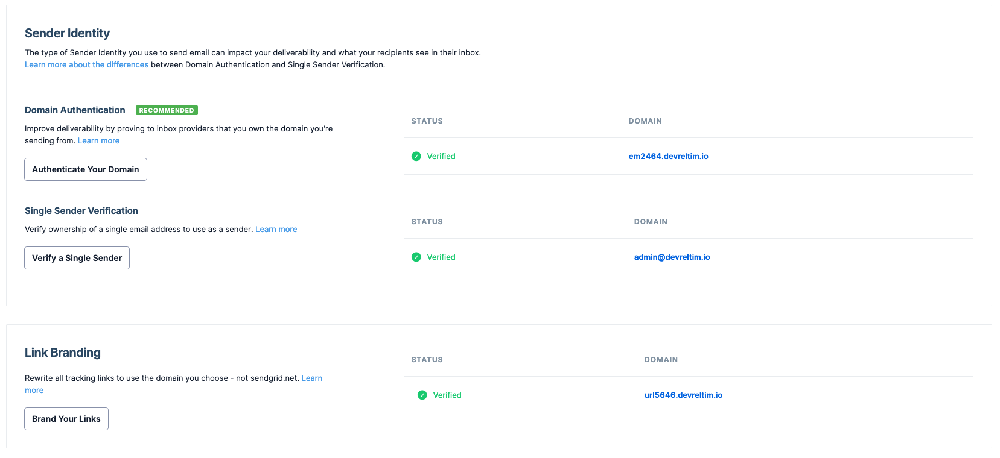

# Supabase on DigitalOcean - Terraform

> _IMPORTANT:_ A note on secrets/tokens/apis and the `terraform.tfstate` file. Ensure that any files containing secrets/tokens/apis as well as the `terraform.tfstate` file are _NOT_ stored in version control.

This is where most of the magic will happen as all you need to do is configure your variables and run 3 _(2 if you're confident in what is happening)_ commands.

```bash
## From the root of the repository change directory to the terraform directory
## (from the packer directory  use ../terraform)
cd terraform

## Copy the example file to terraform.tfvars, modify it with your own variables and save
cp terraform.tfvars.example terraform.tfvars
```

A list of required variables, as well as optional variables with their default values, is documented below. Go through the list and modify the `terraform.tfvars` accordingly with your own values.

After creating the variables run the following commands to deploy the resources:

```bash
## Initialise terraform to download any plugin binaries needed
terraform init

## Create and show a plan of what will be created
## (skip if you want to apply immediately)
terraform plan

## Apply the changes specified by confirming at the prompt
## (--auto-approve if you're feeling adventures)
terraform apply
```

Once all the resources have been created you'll see the following message (the bucket name, volume id and reserved ip will obviously be different):

```
Apply complete! Resources: 24 added, 0 changed, 0 destroyed.

Outputs:

bucket = "supabase-1a2b3c4d5e6f7g8h"
droplet_volume_id = "12345678-abcd-12ab-34cd-123456abcdef"
htpasswd = <sensitive>
jwt = <sensitive>
jwt_anon = <sensitive>
jwt_service_role = <sensitive>
psql_pass = <sensitive>
reserved_ip = "123.456.789.000"
sendgrid_generated_api = <sensitive>
```

As the SendGrid Single Sender, Domain Authentication and Link Branding resources are created before the domain records are created, we need to verify them before being able to send emails via SendGrid. You can either use SendGrid's UI, within Settings > Sender Authentication of your account to manually verify them or rerun the apply command.

```bash
## Re-apply terraform to verify SendGrid resources
terraform apply
```

Within SendGrid's UI you should now have green ticks showing that all the resources have been verified.
_N.B. Updates to your nameservers with your domain registrar and records within DigitalOcean can take up to 48 hours to propagate (unlikely but possible)._



You'll need to grab the passwords and tokens generated by terraform to access and make use of the system. To do this run the following commands (**_AGAIN ensure you do not store secrets in version control_**)

```bash
## Show the generated auth password
terraform output htpasswd

## Show the generated psql password
terraform output psql_pass

## Show the generated jwt secret and tokens
terraform output jwt
terraform output jwt_anon
terraform output jwt_service_role
```

Now take a **5-10 min** break and grab a coffee, cup of tea, etc. The Droplet needs time to download all the containers, extract them, configure ssl certs and more (I’m not kidding, the supabase-db container alone is over 1GB to download and when extracted is over 2GB).

After taking a well deserved little break go to your browser and input the supabase domain in the format `supabase.${your-domain}`. A pop-up appears asking you to enter your authentication details (your provided username and the generated htpasswd).

You're done!!! You've now got a secure supabase self-hosted system running on DigitalOcean with persistent storage.

Enjoy and Happy creating :)

## Terraform file structure

This terraform directory has multiple files to create the wanted architecture:

```bash
.
├── droplet.tf                        # Droplet resource that is created from the previously created snapshot
├── files                             # Directory with templated files
│   ├── .env.tftpl                    # environment variable file to be used by docker-compose
│   ├── .htpasswd.tftpl               # auth credentials for nginx basic authentication
│   ├── digitalocean.ini.tftpl        # DigitalOcean credentials for certbot to use when creating ssl certs
│   ├── kong.yml.tftpl                # kong configuration file
│   └── sender-verification.sh.tmpl   # script to create single sender verification on SendGrid (more info below)
├── locals.tf                         # terraform locals that are used within other resources (also creates passwords/tokens)
├── network.tf                        # Domain, Reserved IP and Firewall creation
├── outputs.tf                        # outputs required computed variables (will also output sensitive information in the tfstate file)
├── project.tf                        # currently not in use
├── provider.tf                       # sets up all the providers and requirements to run terraform
├── sendgrid.tf                       # setups SendGrid single sender verification, domain authentication and link branding (more info below)
├── storage.tf                        # creates a Volume to attach to the Droplet and a Spaces bucket for object storage
├── terraform.tfvars.example          # example tfvars file, copy and modify as specified above
└── variables.tf                      # terraform variable definitions and requirements
```

I won't be going into the specifics of each and every file, but if you have any questions or comments do not hesitate to reach out.

**_What's happening in the background_**

When you confirm the output of the `terraform apply` command (or if you were feeling adventures, after hitting return on the `terraform apply --auto-approve` command), terraform creates a dependency graph to determine in which order to create resources (if you really want to get into the specifics of it all the [Terraform internals documentation](https://developer.hashicorp.com/terraform/internals) is great, especially the [Resource Graph section](https://developer.hashicorp.com/terraform/internals/graph)).

### A note about securing the Droplet and Spaces

The Firewall opens Ports 80 and 443 for general web interaction and also Port 22 to be able to SSH into the Droplet. We highly suggest that you SSH into the Droplet by using an [ssh key](https://docs.digitalocean.com/products/droplets/how-to/add-ssh-keys/) and that you restrict the IPs that can SSH into it by setting the `ssh_ip_range` variable.

A policy for the Spaces bucket is created during the creation process. This policy can be restricted to only allow  access to the bucket via the Restricted IP, Droplet IP and IPs specified in `ssh_ip_range` (if populated) by setting the `spaces_restrict_ip` variable to `true` (default `false`). If you do set the `spaces_restrict_ip` variable to `true` be aware that you won't be able to access artifacts in the bucket via DigitalOcean's UI (If needed you can set the variable back to `false` and run `terraform apply` again).

### A note about the SendGrid Provider

The SendGrid Provider is not an official provider (which is fine, here at DO we [Love](https://www.digitalocean.com/about) Open Source). This does mean that it does not fully support SendGrid's api currently. Which is why a [_hack_](./sendgrid.tf) has been implemented to automate the creation of the Single Sender Verification. If one of the providers ever supports this functionality this will be implemented for robustness, until then we have to make way for this _hack_. Regarding this please note the comment about destroying this resource (or lack of ability to do this currently).

### A note on destroying

Should you wish to destroy the resources created all you need to do is run the destroy command (makes sense).

```bash
## Destroy the resources specified by confirming at the prompt
## (as with apply you can --auto-approve if you're feeling adventures)
terraform destroy
```

If you have any artifacts stored in your Spaces bucket the terraform destroy command will partly fail warning that the bucket cannot be destroyed. To destroy it you'll have to first remove all artifacts within the bucket and re-run `terraform destroy`.

Also Terraform won't destroy the Single Sender created in SendGrid (told you it was a hack), so you'll have to manually delete this yourself via SendGrid's UI.

## Terraform documentation

- Providers, Inputs and Outputs will be automatically documented using pre-commit hooks in the `README.md` file
  - To automatically create the documentation you need to install the hooks as described below
- The subdirectory has a `terraform.tfvars.example` file holding example values for variables required to implement the infrastructure.

### Hooks

Install `pre-commit` and `terraform-docs` (on MacOS, Homebrew has formulae for both).
Then run the `pre-commit install` command to install the pre-commit hooks specified.

<!-- BEGINNING OF PRE-COMMIT-TERRAFORM DOCS HOOK -->
## Providers

| Name | Version |
|------|---------|
| <a name="provider_cloudinit"></a> [cloudinit](#provider\_cloudinit) | 2.2.0 |
| <a name="provider_digitalocean"></a> [digitalocean](#provider\_digitalocean) | 2.25.2 |
| <a name="provider_htpasswd"></a> [htpasswd](#provider\_htpasswd) | 1.0.4 |
| <a name="provider_jwt"></a> [jwt](#provider\_jwt) | 1.1.0 |
| <a name="provider_null"></a> [null](#provider\_null) | 3.2.1 |
| <a name="provider_random"></a> [random](#provider\_random) | 3.4.3 |
| <a name="provider_sendgrid"></a> [sendgrid](#provider\_sendgrid) | 0.2.0 |
| <a name="provider_time"></a> [time](#provider\_time) | 0.9.1 |

## Inputs

| Name | Description | Type | Default | Required |
|------|-------------|------|---------|:--------:|
| <a name="input_auth_user"></a> [auth\_user](#input\_auth\_user) | The username for Nginx authentication. | `string` | n/a | yes |
| <a name="input_do_token"></a> [do\_token](#input\_do\_token) | DO API token with read and write permissions. | `string` | n/a | yes |
| <a name="input_domain"></a> [domain](#input\_domain) | Domain name where the Supabase instance is accessible. The final domain will be of the format `supabase.example.com` | `string` | n/a | yes |
| <a name="input_region"></a> [region](#input\_region) | The region where the Droplet will be created. | `string` | n/a | yes |
| <a name="input_sendgrid_api"></a> [sendgrid\_api](#input\_sendgrid\_api) | SendGrid API Key. | `string` | n/a | yes |
| <a name="input_site_url"></a> [site\_url](#input\_site\_url) | Domain name of your application in the format. | `string` | n/a | yes |
| <a name="input_smtp_addr"></a> [smtp\_addr](#input\_smtp\_addr) | Company Address of the Verified Sender. Max 100 characters. If more is needed use `smtp_addr_2` | `string` | n/a | yes |
| <a name="input_smtp_admin_user"></a> [smtp\_admin\_user](#input\_smtp\_admin\_user) | `From` email address for all emails sent. | `string` | n/a | yes |
| <a name="input_smtp_city"></a> [smtp\_city](#input\_smtp\_city) | Company city of the verified sender. | `string` | n/a | yes |
| <a name="input_smtp_country"></a> [smtp\_country](#input\_smtp\_country) | Company country of the verified sender. | `string` | n/a | yes |
| <a name="input_spaces_access_key_id"></a> [spaces\_access\_key\_id](#input\_spaces\_access\_key\_id) | Access key ID used for Spaces API operations. | `string` | n/a | yes |
| <a name="input_spaces_secret_access_key"></a> [spaces\_secret\_access\_key](#input\_spaces\_secret\_access\_key) | Secret access key used for Spaces API operations. | `string` | n/a | yes |
| <a name="input_timezone"></a> [timezone](#input\_timezone) | Timezone to use for Nginx (e.g. Europe/Amsterdam). | `string` | n/a | yes |
| <a name="input_db_ip_range"></a> [db\_ip\_range](#input\_db\_ip\_range) | An array of strings containing the IPv4 addresses and/or IPv4 CIDRs from which the inbound traffic will be accepted for the Database. Defaults to ALL IPv4s but it is highly suggested to choose a smaller subset. | `list(string)` | <pre>[<br>  "0.0.0.0/0"<br>]</pre> | no |
| <a name="input_droplet_backups"></a> [droplet\_backups](#input\_droplet\_backups) | Boolean controlling if backups are made. Defaults to true. | `bool` | `true` | no |
| <a name="input_droplet_image"></a> [droplet\_image](#input\_droplet\_image) | The Droplet image ID or slug. This could be either image ID or droplet snapshot ID. | `string` | `"ubuntu-22-10-x64"` | no |
| <a name="input_droplet_size"></a> [droplet\_size](#input\_droplet\_size) | The unique slug that identifies the type of Droplet. | `string` | `"s-1vcpu-2gb"` | no |
| <a name="input_enable_db_con"></a> [enable\_db\_con](#input\_enable\_db\_con) | Boolean enabling connections to database by opening port 5432 on the firewall. | `bool` | `false` | no |
| <a name="input_enable_ssh"></a> [enable\_ssh](#input\_enable\_ssh) | Boolean enabling connections to droplet via SSH by opening port 22 on the firewall. | `bool` | `true` | no |
| <a name="input_smtp_addr_2"></a> [smtp\_addr\_2](#input\_smtp\_addr\_2) | Company Address Line 2. Max 100 characters. | `string` | `""` | no |
| <a name="input_smtp_host"></a> [smtp\_host](#input\_smtp\_host) | The external mail server hostname to send emails through. | `string` | `"smtp.sendgrid.net"` | no |
| <a name="input_smtp_nickname"></a> [smtp\_nickname](#input\_smtp\_nickname) | Nickname to show recipient. Defaults to `smtp_sender_name` or the email address specified in the `smtp_admin_user` variable if neither are specified. | `string` | `""` | no |
| <a name="input_smtp_port"></a> [smtp\_port](#input\_smtp\_port) | Port number to connect to the external mail server on. | `number` | `465` | no |
| <a name="input_smtp_reply_to"></a> [smtp\_reply\_to](#input\_smtp\_reply\_to) | Email address to show in the `reply-to` field within an email. Defaults to the email address specified in the `smtp_admin_user` variable. | `string` | `""` | no |
| <a name="input_smtp_reply_to_name"></a> [smtp\_reply\_to\_name](#input\_smtp\_reply\_to\_name) | Friendly name to show recipient rather than email address in the `reply-to` field within an email. Defaults to `smtp_sender_name` or `smtp_reply_to` if `smtp_sender_name` is not set, or the email address specified in the `smtp_admin_user` variable if neither are specified. | `string` | `""` | no |
| <a name="input_smtp_sender_name"></a> [smtp\_sender\_name](#input\_smtp\_sender\_name) | Friendly name to show recipient rather than email address. Defaults to the email address specified in the `smtp_admin_user` variable. | `string` | `""` | no |
| <a name="input_smtp_state"></a> [smtp\_state](#input\_smtp\_state) | Company State. | `string` | `""` | no |
| <a name="input_smtp_user"></a> [smtp\_user](#input\_smtp\_user) | The username to use for mail server requires authentication | `string` | `"apikey"` | no |
| <a name="input_smtp_zip_code"></a> [smtp\_zip\_code](#input\_smtp\_zip\_code) | Company Zip Code. | `string` | `""` | no |
| <a name="input_spaces_restrict_ip"></a> [spaces\_restrict\_ip](#input\_spaces\_restrict\_ip) | Boolean signifying whether to restrict the spaces bucket to the droplet and reserved ips (as well as the ssh ips if set) or allow all ips. (N.B. If Enabled this will also disable Bucket access from DO's UI.) | `bool` | `false` | no |
| <a name="input_ssh_ip_range"></a> [ssh\_ip\_range](#input\_ssh\_ip\_range) | An array of strings containing the IPv4 addresses and/or IPv4 CIDRs from which the inbound traffic will be accepted for SSH. Defaults to ALL IPv4s but it is highly suggested to choose a smaller subset. | `list(string)` | <pre>[<br>  "0.0.0.0/0"<br>]</pre> | no |
| <a name="input_ssh_keys"></a> [ssh\_keys](#input\_ssh\_keys) | A list of SSH key IDs or fingerprints to enable in the format [12345, 123456]. Only one of `var.ssh_keys` or `var.ssh_pub_file` needs to be specified and should be used. | `list(string)` | `[]` | no |
| <a name="input_ssh_pub_file"></a> [ssh\_pub\_file](#input\_ssh\_pub\_file) | The path to the public key ssh file. Only one of var.ssh\_pub\_file or var.ssh\_keys needs to be specified and should be used. | `string` | `""` | no |
| <a name="input_studio_org"></a> [studio\_org](#input\_studio\_org) | Organization for Studio Configuration. | `string` | `"Default Organization"` | no |
| <a name="input_studio_project"></a> [studio\_project](#input\_studio\_project) | Project for Studio Configuration. | `string` | `"Default Project"` | no |
| <a name="input_tags"></a> [tags](#input\_tags) | A list of the tags to be added to the default (`["supabase", "digitalocean", "terraform"]`) Droplet tags. | `list(string)` | `[]` | no |
| <a name="input_volume_size"></a> [volume\_size](#input\_volume\_size) | The size of the block storage volume in GiB. If updated, can only be expanded. | `number` | `25` | no |

## Outputs

| Name | Description |
|------|-------------|
| <a name="output_bucket"></a> [bucket](#output\_bucket) | The unique name of the bucket in the format `supabase-ab12cd34ef56gh78`. |
| <a name="output_droplet_volume_id"></a> [droplet\_volume\_id](#output\_droplet\_volume\_id) | The unique identifier for the volume attached to the droplet. |
| <a name="output_htpasswd"></a> [htpasswd](#output\_htpasswd) | Randomly generated 32 character password for authentication via Nginx. |
| <a name="output_jwt"></a> [jwt](#output\_jwt) | Randomly generated 40 character jwt secret. |
| <a name="output_jwt_anon"></a> [jwt\_anon](#output\_jwt\_anon) | The HS256 generated jwt token for the `anon` role. |
| <a name="output_jwt_exp"></a> [jwt\_exp](#output\_jwt\_exp) | The Expiration time for the `anon` and `service_role` jwt tokens in epoch time. |
| <a name="output_jwt_iat"></a> [jwt\_iat](#output\_jwt\_iat) | The Issued At time for the `anon` and `service_role` jwt tokens in epoch time. |
| <a name="output_jwt_service_role"></a> [jwt\_service\_role](#output\_jwt\_service\_role) | The HS256 generated jwt token for the `service_role` role. |
| <a name="output_psql_pass"></a> [psql\_pass](#output\_psql\_pass) | Randomly generated 32 character password for the Postgres database. |
| <a name="output_reserved_ip"></a> [reserved\_ip](#output\_reserved\_ip) | The Reserved IP assigned to the droplet. |
| <a name="output_sendgrid_generated_api"></a> [sendgrid\_generated\_api](#output\_sendgrid\_generated\_api) | SendGrid API key to allow sending of emails (The api key is limited to Send Mail scope only). |
  <!-- END OF PRE-COMMIT-TERRAFORM DOCS HOOK -->
